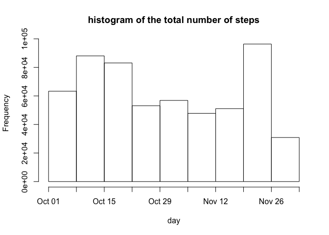
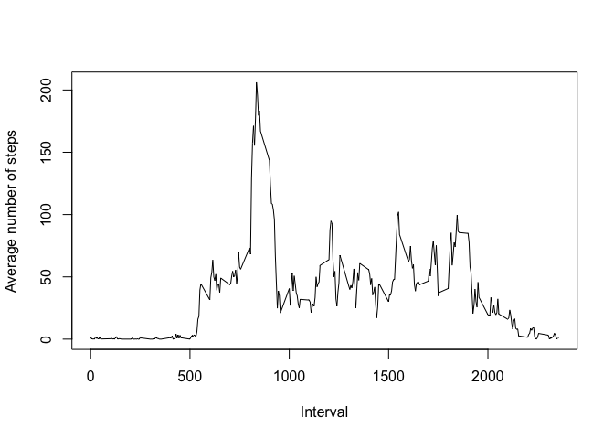
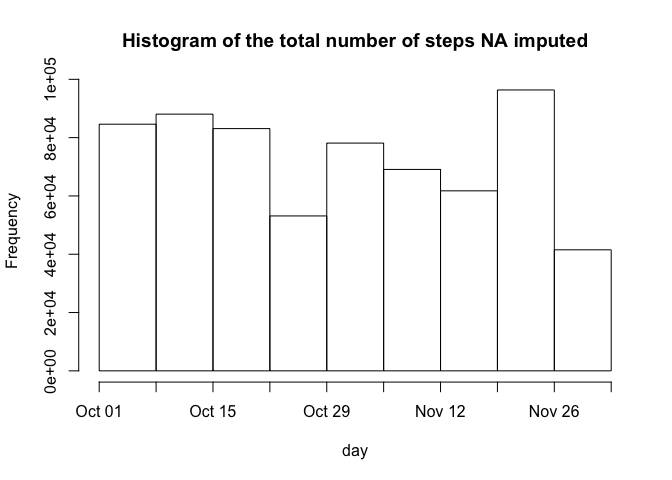
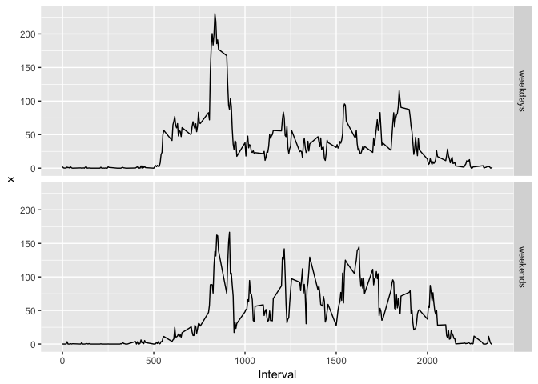

# Reproducible Research: Peer Assessment 1


## Loading and preprocessing the data


```r
rm(list=ls())
cat("\014")
```



```r
library(dplyr)
```

```
## 
## Attaching package: 'dplyr'
```

```
## The following objects are masked from 'package:stats':
## 
##     filter, lag
```

```
## The following objects are masked from 'package:base':
## 
##     intersect, setdiff, setequal, union
```

```r
library(ggplot2)
raw_data <- read.csv("activity.csv",header = TRUE)
raw_data$date <- as.Date(strptime(raw_data$date ,"%Y-%m-%d"))
raw_data_res <- raw_data
raw_dataf <- raw_data[!is.na(raw_data$steps),]
```

## What is mean total number of steps taken per day?

```r
date_his <- rep(raw_dataf$date,raw_dataf$steps)
hist( date_his , breaks = "weeks" , freq = TRUE , main = "histogram of the total number of steps" , xlab = "day")
```

<!-- -->

```r
total_steps <- data.frame(aggregate(raw_dataf$steps , by=list(Date=raw_dataf$date) , FUN = sum))
mean_steps <- mean(total_steps$x)
median_steps <- median(total_steps$x)
```
The mean and median of the total number of steps taken per day are 1.0766189\times 10^{4} and 10765 respectively.


## What is the average daily activity pattern?

```r
interval_plot <- aggregate(raw_dataf$steps , by=list(Interval=raw_dataf$interval) , FUN = mean)
with(interval_plot,plot(Interval,x,type = "l",xlab = "Interval",ylab = "Average number of steps"))
```

<!-- -->

```r
max_int <- interval_plot[which.max(interval_plot$x),1]
```
The interval 835 has the maximum number of steps on average across all the days in the dataset.


## Imputing missing values

```r
NA_num <- sum(is.na(raw_data$steps))
num <- dim(raw_data)[1]
for (i in seq(num)){
  if( is.na(raw_data$steps[i]) ){
    raw_data$steps[i] <- trunc(interval_plot$x[raw_data$interval[i]==interval_plot$Interval])
  }
}
date_his_im <- rep(raw_data$date,raw_data$steps)
hist( date_his_im , breaks = "weeks" , freq = TRUE , main = "Histogram of the total number of steps NA imputed" , xlab = "day")
```

<!-- -->

```r
total_steps_im <- data.frame(aggregate(raw_data$steps , by=list(Date=raw_data$date) , FUN = sum))
mean_steps_im <- mean(total_steps_im$x)
median_steps_im <- median(total_steps_im$x)
error_mean <- abs((mean_steps_im-mean_steps)/mean_steps)*100
error_median <-  abs((median_steps_im-median_steps)/median_steps)*100
```

There are 2304 values missing. To impute the missing values they are filled in by the number of steps for each interval avaraged across all days. As anticipated, the avarage number of steps are not whole, they are rounded up. As we can see there is a clear difference in the histogram where the missing values are imputed compared to the first part of the assignment. In this case, the mean and median of the total number of steps taken per day are 1.074977\times 10^{4} and 1.0641\times 10^{4} respectively which are 0.1524977% and 1.1518811% different. The differences are not significant. 


## Are there differences in activity patterns between weekdays and weekends?

```r
weekdays <- c('Monday', 'Tuesday', 'Wednesday', 'Thursday', 'Friday')
raw_data$weekdays <- factor((weekdays(raw_data$date) %in% weekdays), 
                   levels=c(FALSE, TRUE), labels=c('weekend', 'weekday') )
split_data <- split(raw_data,raw_data$weekdays)
interval_wd <- aggregate(split_data$weekday$steps , by=list(Interval=split_data$weekday$interval) , FUN = mean)
num_wd <- dim(interval_wd)[1]
interval_wd$weekdays <- as.factor(rep("weekdays",num_wd))
interval_we <- aggregate(split_data$weekend$steps , by=list(Interval=split_data$weekend$interval) , FUN = mean)
num_we <- dim(interval_we)[1]
interval_we$weekdays <- as.factor(rep("weekends",num_we))
data_days <- rbind(interval_wd,interval_we)
qplot(Interval,x,data = data_days , facets = weekdays~. , geom = "line")
```

<!-- -->

